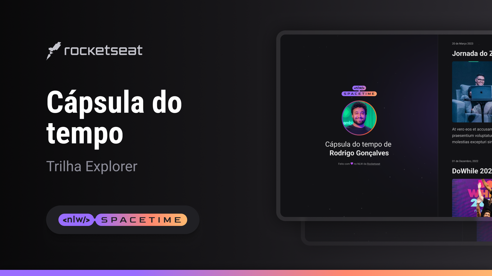

## 🖥️ Projeto

Esse é um projeto web responsivo de uma capsula do tempo para exibirt memórias em uma linha do tempo.

## 🚀 Tecnologias

Esse projeto foi desenvolvido durate a NLW SpaceTime da Rocketseat com as seguintes tecnologias:

- HTML
- CSS
- GIT e Github
